# 멀티 에이전트 시스템 다이어그램 모음

> **작성일**: 2025-11-08
> **버전**: v1.0.0
> **목적**: 멀티 에이전트 시스템의 시각화

---

## 📋 목차

1. [전체 시스템 아키텍처](#1-전체-시스템-아키텍처)
2. [에이전트 역할 및 책임](#2-에이전트-역할-및-책임)
3. [작업 흐름 (워크플로우)](#3-작업-흐름-워크플로우)
4. [데이터 흐름](#4-데이터-흐름)
5. [의존성 그래프](#5-의존성-그래프)
6. [시퀀스 다이어그램 (상세 예시)](#6-시퀀스-다이어그램-상세-예시)
7. [파일 시스템 구조](#7-파일-시스템-구조)
8. [상태 머신](#8-상태-머신)
9. [통신 프로토콜](#9-통신-프로토콜)
10. [프레임워크 감지 로직](#10-프레임워크-감지-로직)
11. [성능 최적화 전략](#11-성능-최적화-전략)
12. [상세 플로우차트](#12-상세-플로우차트)

---

## 1. 전체 시스템 아키텍처

### 1.1 레이어드 아키텍처

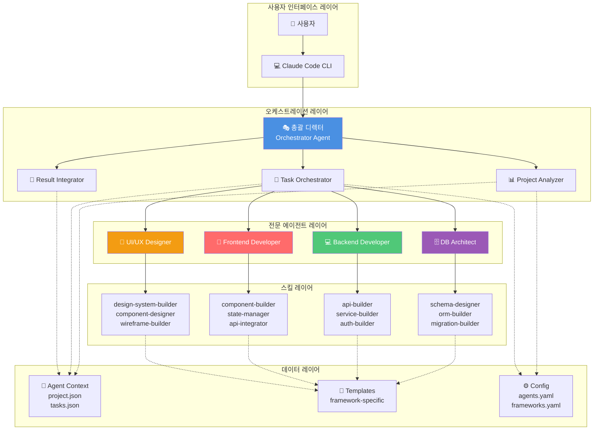

---

## 2. 에이전트 역할 및 책임

### 2.1 에이전트 책임 매트릭스

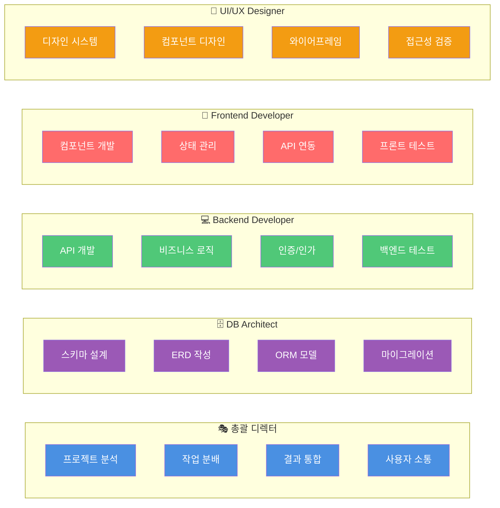

---

## 3. 작업 흐름 (워크플로우)

### 3.1 전체 워크플로우


---

## 4. 데이터 흐름

### 4.1 컨텍스트 데이터 흐름

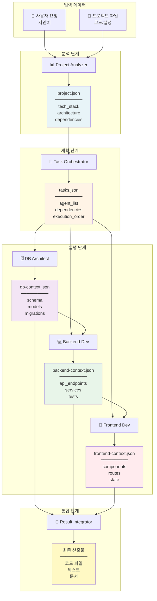

---

## 5. 의존성 그래프

### 5.1 에이전트 간 의존성

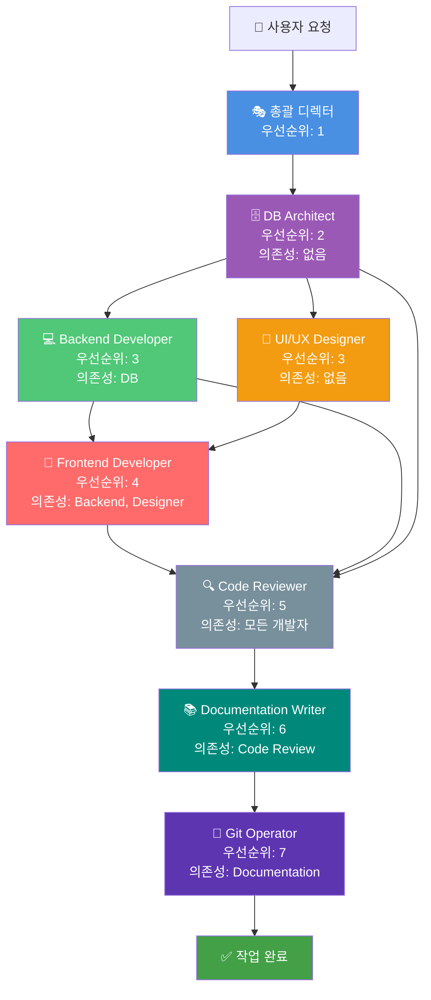

### 5.2 병렬 vs 순차 실행

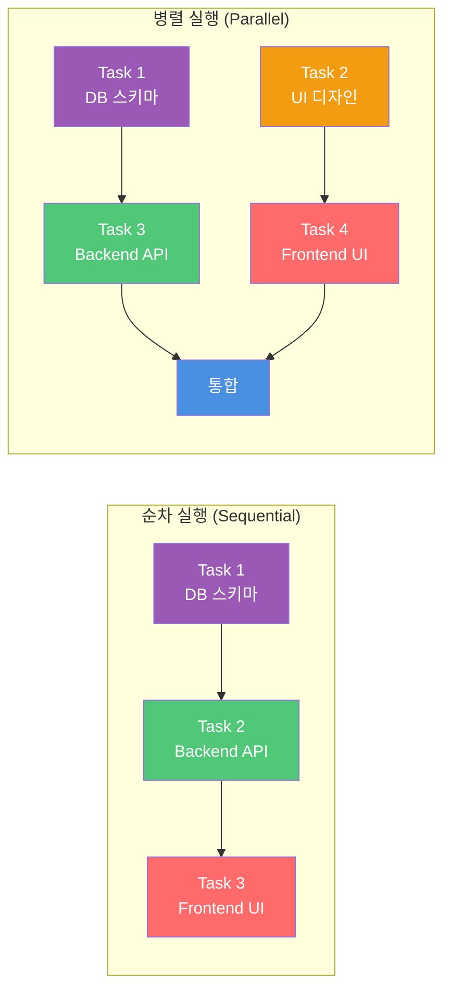

---

## 6. 시퀀스 다이어그램 (상세 예시)

### 6.1 전체 시스템 시퀀스

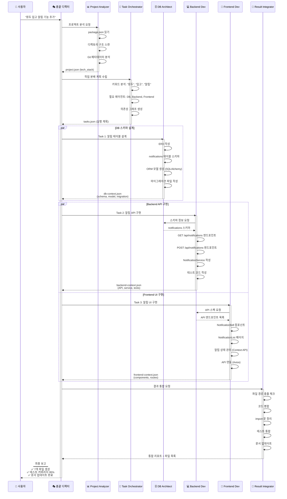

### 6.2 에러 처리 시퀀스

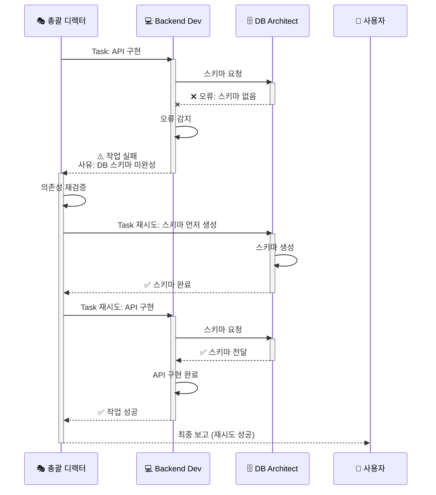

---

## 7. 파일 시스템 구조

### 7.1 디렉토리 트리

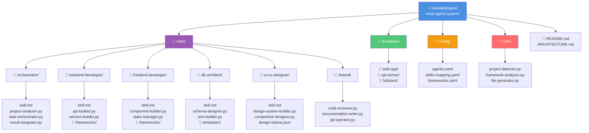

### 7.2 프로젝트별 컨텍스트

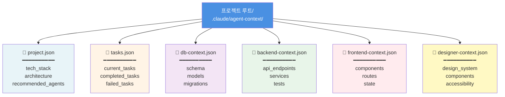

---

## 8. 상태 머신

### 8.1 작업 상태 전이

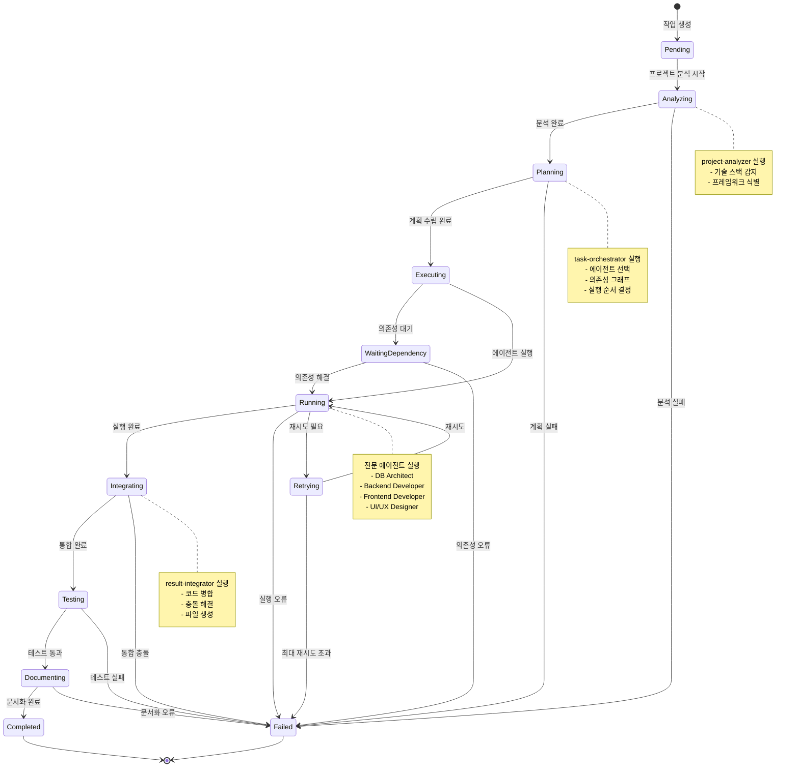

### 8.2 에이전트 상태 전이

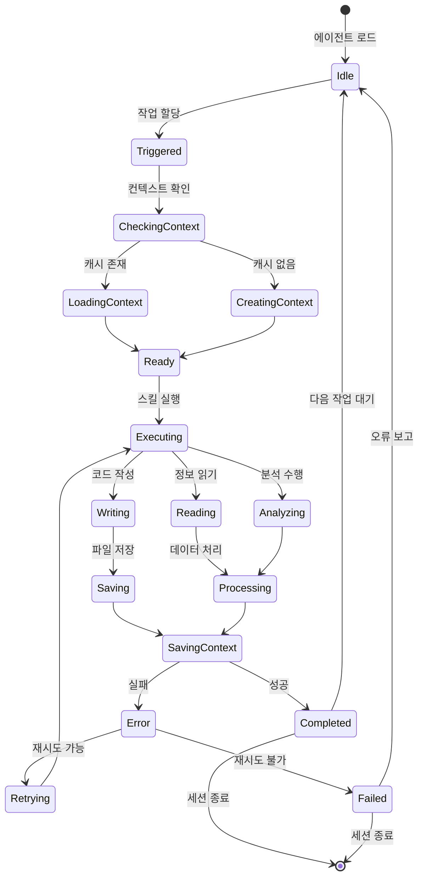

---

## 9. 통신 프로토콜

### 9.1 메시지 흐름

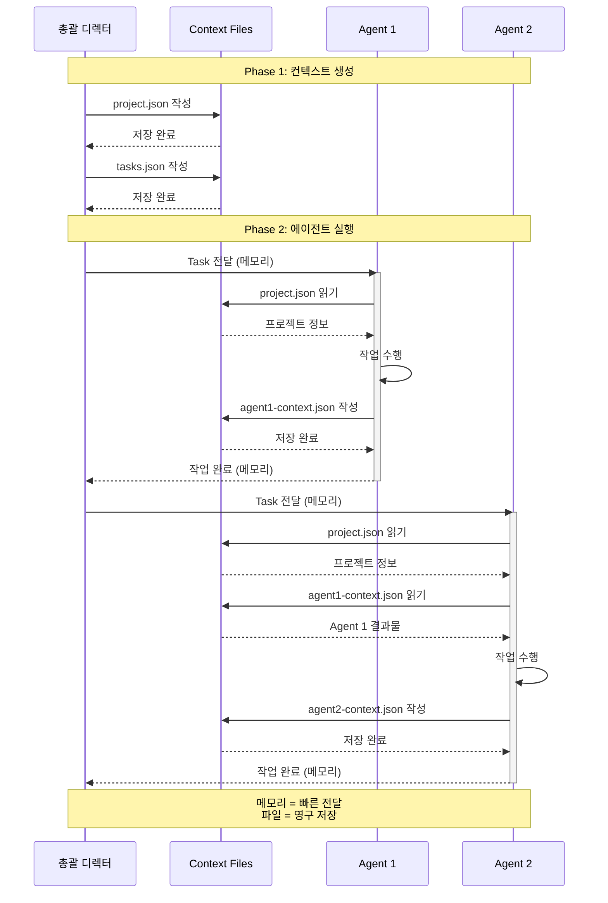

---

## 10. 프레임워크 감지 로직

### 10.1 결정 트리


---

## 11. 성능 최적화 전략

### 11.1 캐싱 전략

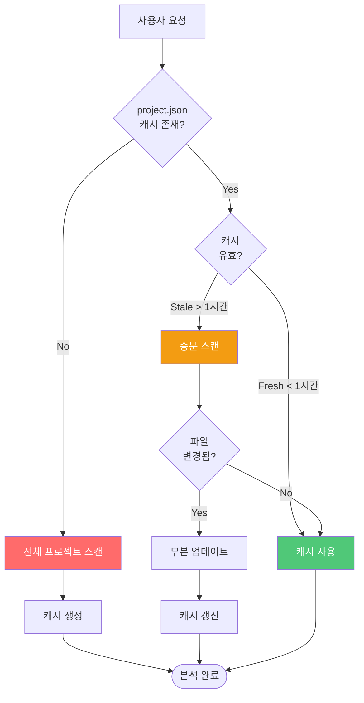

### 11.2 병렬 실행 최적화

```mermaid
gantt
    title 작업 실행 타임라인 (순차 vs 병렬)
    dateFormat  ss
    axisFormat %S초

    section 순차 실행
    프로젝트 분석        :a1, 00, 10s
    DB 스키마 설계       :a2, after a1, 15s
    Backend API 구현     :a3, after a2, 20s
    Frontend UI 구현     :a4, after a3, 18s
    결과 통합           :a5, after a4, 7s
    총 70초             :milestone, after a5, 0s

    section 병렬 실행
    프로젝트 분석        :b1, 00, 10s
    DB 스키마 설계       :b2, after b1, 15s
    Backend API 구현     :b3, after b2, 20s
    Frontend UI 구현     :crit, after b2, 18s
    UI 디자인           :crit, after b1, 12s
    결과 통합           :b5, after b3, 7s
    총 52초             :milestone, after b5, 0s
```

---

## 12. 상세 플로우차트

### 12.1 총괄 디렉터 실행 플로우

```mermaid
flowchart TD
    Start([총괄 디렉터 시작]) --> ReceiveRequest[사용자 요청 수신]

    ReceiveRequest --> ParseRequest[요청 파싱 및 분석]

    ParseRequest --> CheckProjectCache{project.json<br/>캐시 존재?}

    CheckProjectCache -->|Yes| LoadCache[캐시 로드]
    CheckProjectCache -->|No| RunAnalyzer[Project Analyzer 실행]

    RunAnalyzer --> ScanFiles[파일 시스템 스캔]
    ScanFiles --> DetectFramework[프레임워크 감지]
    DetectFramework --> AnalyzeDeps[의존성 분석]
    AnalyzeDeps --> GenerateProjectJson[project.json 생성]
    GenerateProjectJson --> LoadCache

    LoadCache --> ExtractKeywords[요청에서 키워드 추출]

    ExtractKeywords --> MatchAgents[에이전트 매칭<br/>keywords + file_patterns]

    MatchAgents --> BuildDepGraph[의존성 그래프 생성]

    BuildDepGraph --> CheckDeps{에이전트 간<br/>의존성 존재?}

    CheckDeps -->|Yes| PlanSequential[순차 실행 계획]
    CheckDeps -->|No| PlanParallel[병렬 실행 계획]
    CheckDeps -->|Mixed| PlanHybrid[하이브리드 실행 계획]

    PlanSequential --> GenerateTasksJson[tasks.json 생성]
    PlanParallel --> GenerateTasksJson
    PlanHybrid --> GenerateTasksJson

    GenerateTasksJson --> ExecuteAgents[에이전트 실행<br/>Task tool 호출]

    ExecuteAgents --> MonitorProgress[진행 상황 모니터링]

    MonitorProgress --> CheckComplete{모든 에이전트<br/>완료?}

    CheckComplete -->|No| WaitResults[결과 대기]
    WaitResults --> MonitorProgress

    CheckComplete -->|Yes| CollectResults[결과 수집]

    CollectResults --> CheckErrors{오류 발생?}

    CheckErrors -->|Yes| AnalyzeError[오류 분석]
    AnalyzeError --> CheckRetryable{재시도<br/>가능?}

    CheckRetryable -->|Yes| RetryAgent[에이전트 재실행]
    RetryAgent --> MonitorProgress

    CheckRetryable -->|No| ReportError[사용자에게 오류 보고]
    ReportError --> End

    CheckErrors -->|No| IntegrateResults[Result Integrator 실행]

    IntegrateResults --> MergeCode[코드 병합]
    MergeCode --> ResolveConflicts[충돌 해결]
    ResolveConflicts --> GenerateTests[테스트 코드 생성]
    GenerateTests --> UpdateDocs[문서 업데이트]
    UpdateDocs --> CreateReport[최종 리포트 작성]

    CreateReport --> ReportToUser[사용자에게 보고]

    ReportToUser --> End([완료])

    style Start fill:#4A90E2,color:#fff
    style End fill:#50C878,color:#fff
    style RunAnalyzer fill:#9B59B6,color:#fff
    style ExecuteAgents fill:#F39C12,color:#fff
    style IntegrateResults fill:#FF6B6B,color:#fff
    style ReportError fill:#E74C3C,color:#fff
```

---

### 12.2 프로젝트 분석 상세 플로우 (Project Analyzer)

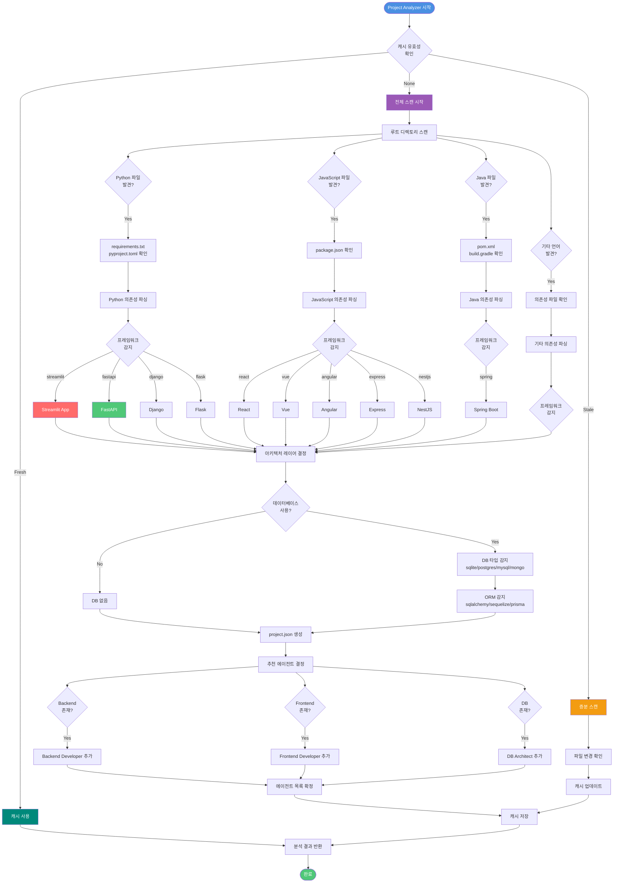

---

### 12.3 작업 분배 의사결정 플로우 (Task Orchestrator)

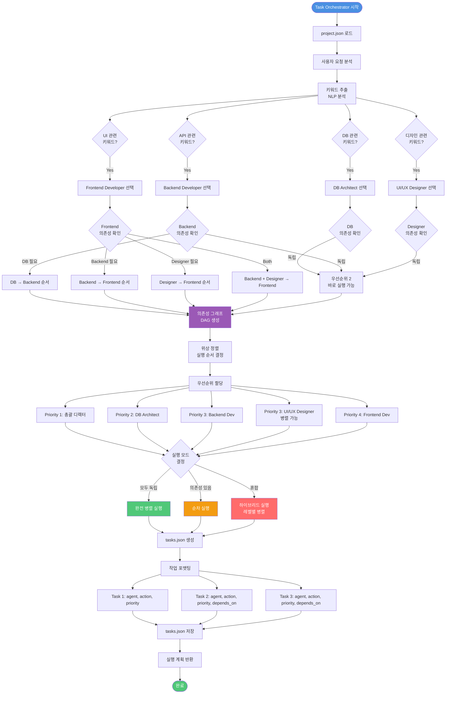

---

### 12.4 DB Architect 실행 플로우

```mermaid
flowchart TD
    Start([DB Architect 시작])

    Start --> LoadContext[project.json + tasks.json 로드]

    LoadContext --> ParseTask[작업 내용 분석]

    ParseTask --> DetermineAction{작업 타입<br/>결정}

    DetermineAction -->|스키마 설계| ActionSchema[schema-designer 스킬]
    DetermineAction -->|ORM 생성| ActionORM[orm-model-builder 스킬]
    DetermineAction -->|마이그레이션| ActionMigration[migration-builder 스킬]
    DetermineAction -->|쿼리 최적화| ActionOptimize[query-optimizer 스킬]

    ActionSchema --> ExtractEntities[엔티티 추출]
    ExtractEntities --> DefineRelations[관계 정의<br/>1:1, 1:N, N:M]
    DefineRelations --> ApplyNormalization[정규화 적용<br/>1NF~3NF]
    ApplyNormalization --> AddConstraints[제약조건 추가<br/>PK, FK, UNIQUE, CHECK]
    AddConstraints --> GenerateERD[ERD 생성<br/>Mermaid]
    GenerateERD --> GenerateSQL[SQL DDL 생성]

    ActionORM --> DetectDBType{DB 타입<br/>확인}

    DetectDBType -->|SQLite| UseSQLAlchemy[SQLAlchemy ORM]
    DetectDBType -->|PostgreSQL| UseSQLAlchemy
    DetectDBType -->|MySQL| UseSQLAlchemy
    DetectDBType -->|MongoDB| UsePyMongo[PyMongo ODM]

    UseSQLAlchemy --> LoadTemplate[SQLAlchemy 템플릿 로드]
    UsePyMongo --> LoadTemplateMongo[PyMongo 템플릿 로드]

    LoadTemplate --> GenerateModel[모델 클래스 생성<br/>declarative_base]
    LoadTemplateMongo --> GenerateModel

    GenerateModel --> AddRelationships[관계 설정<br/>relationship()]
    AddRelationships --> AddValidation[검증 로직 추가]

    ActionMigration --> DetectMigrationTool{마이그레이션<br/>도구 확인}

    DetectMigrationTool -->|Alembic| UseAlembic[Alembic 템플릿]
    DetectMigrationTool -->|Django| UseDjangoMigration[Django Migration]
    DetectMigrationTool -->|Sequelize| UseSequelize[Sequelize Migration]

    UseAlembic --> GenerateMigrationFile[마이그레이션 파일 생성]
    UseDjangoMigration --> GenerateMigrationFile
    UseSequelize --> GenerateMigrationFile

    GenerateMigrationFile --> AddUpgrade[upgrade() 함수]
    AddUpgrade --> AddDowngrade[downgrade() 함수]

    ActionOptimize --> AnalyzeQueries[쿼리 분석]
    AnalyzeQueries --> SuggestIndexes[인덱스 제안]
    SuggestIndexes --> OptimizeJoins[조인 최적화]

    GenerateSQL --> SaveContext
    AddValidation --> SaveContext
    AddDowngrade --> SaveContext
    OptimizeJoins --> SaveContext

    SaveContext[db-context.json 저장] --> WriteFiles[파일 작성]

    WriteFiles --> F1[models/모델명.py]
    WriteFiles --> F2[migrations/버전.py]
    WriteFiles --> F3[schema.sql]

    F1 --> ReturnResult[결과 반환]
    F2 --> ReturnResult
    F3 --> ReturnResult

    ReturnResult --> End([완료])

    style Start fill:#9B59B6,color:#fff
    style End fill:#50C878,color:#fff
    style ActionSchema fill:#4A90E2,color:#fff
    style ActionORM fill:#F39C12,color:#fff
    style ActionMigration fill:#FF6B6B,color:#fff
    style ActionOptimize fill:#00897B,color:#fff
```

---

### 12.5 Backend Developer 실행 플로우

```mermaid
flowchart TD
    Start([Backend Developer 시작])

    Start --> LoadContext[project.json + db-context.json 로드]

    LoadContext --> ParseTask[작업 분석]

    ParseTask --> DetermineAction{작업 타입}

    DetermineAction -->|API 개발| ActionAPI[api-builder 스킬]
    DetermineAction -->|비즈니스 로직| ActionService[service-layer-builder 스킬]
    DetermineAction -->|인증/보안| ActionAuth[auth-security-builder 스킬]
    DetermineAction -->|테스트| ActionTest[backend-tester 스킬]

    ActionAPI --> DetectFramework{프레임워크<br/>확인}

    DetectFramework -->|FastAPI| UseFastAPI[FastAPI 템플릿]
    DetectFramework -->|Django| UseDjango[Django 템플릿]
    DetectFramework -->|Express| UseExpress[Express 템플릿]
    DetectFramework -->|Spring| UseSpring[Spring 템플릿]

    UseFastAPI --> FastAPIFlow[FastAPI 플로우]
    UseDjango --> DjangoFlow[Django 플로우]
    UseExpress --> ExpressFlow[Express 플로우]
    UseSpring --> SpringFlow[Spring 플로우]

    FastAPIFlow --> CreateRouter[APIRouter 생성]
    CreateRouter --> DefineEndpoint[엔드포인트 정의<br/>@app.get/post/put/delete]
    DefineEndpoint --> CreatePydantic[Pydantic 모델<br/>request/response]
    CreatePydantic --> AddValidation[유효성 검증]
    AddValidation --> CallService[서비스 레이어 호출]

    DjangoFlow --> CreateView[View 클래스 생성]
    CreateView --> DefineURL[urls.py 정의]
    DefineURL --> CreateSerializer[Serializer 생성]
    CreateSerializer --> CallService

    ExpressFlow --> CreateExpressRouter[Router 생성]
    CreateExpressRouter --> DefineExpressRoute[라우트 정의]
    DefineExpressRoute --> AddMiddleware[미들웨어 추가]
    AddMiddleware --> CallService

    SpringFlow --> CreateController[@RestController]
    CreateController --> DefineMapping[@GetMapping/@PostMapping]
    DefineMapping --> CreateDTO[DTO 생성]
    CreateDTO --> CallService

    ActionService --> DefineBusinessLogic[비즈니스 로직 정의]
    DefineBusinessLogic --> LoadDBModels[DB 모델 로드<br/>db-context.json]
    LoadDBModels --> ImplementCRUD[CRUD 메서드 구현<br/>Create/Read/Update/Delete]
    ImplementCRUD --> AddTransactions[트랜잭션 처리]
    AddTransactions --> ErrorHandling[오류 처리]

    ActionAuth --> ChooseAuthMethod{인증 방식<br/>선택}

    ChooseAuthMethod -->|JWT| ImplJWT[JWT 구현]
    ChooseAuthMethod -->|OAuth| ImplOAuth[OAuth 구현]
    ChooseAuthMethod -->|Session| ImplSession[Session 구현]

    ImplJWT --> HashPassword[비밀번호 해싱<br/>bcrypt]
    ImplOAuth --> HashPassword
    ImplSession --> HashPassword

    HashPassword --> CreateAuthEndpoint[로그인/회원가입<br/>엔드포인트]
    CreateAuthEndpoint --> AddAuthMiddleware[인증 미들웨어]

    ActionTest --> ChooseTestFramework{테스트<br/>프레임워크}

    ChooseTestFramework -->|pytest| UsePytest[pytest 템플릿]
    ChooseTestFramework -->|jest| UseJest[jest 템플릿]
    ChooseTestFramework -->|junit| UseJUnit[JUnit 템플릿]

    UsePytest --> WriteUnitTests[단위 테스트 작성]
    UseJest --> WriteUnitTests
    UseJUnit --> WriteUnitTests

    WriteUnitTests --> WriteIntegrationTests[통합 테스트 작성]
    WriteIntegrationTests --> AddTestFixtures[Fixture 설정]
    AddTestFixtures --> AddMocking[Mocking 추가]

    CallService --> SaveContext
    ErrorHandling --> SaveContext
    AddAuthMiddleware --> SaveContext
    AddMocking --> SaveContext

    SaveContext[backend-context.json 저장] --> WriteFiles[파일 작성]

    WriteFiles --> BF1[api/엔드포인트.py]
    WriteFiles --> BF2[services/서비스.py]
    WriteFiles --> BF3[tests/test_*.py]

    BF1 --> ReturnResult[결과 반환]
    BF2 --> ReturnResult
    BF3 --> ReturnResult

    ReturnResult --> End([완료])

    style Start fill:#50C878,color:#fff
    style End fill:#50C878,color:#fff
    style UseFastAPI fill:#009688,color:#fff
    style UseDjango fill:#0D47A1,color:#fff
    style UseExpress fill:#FFD600,color:#000
    style UseSpring fill:#6DB33F,color:#fff
```

---

### 12.6 Frontend Developer 실행 플로우

```mermaid
flowchart TD
    Start([Frontend Developer 시작])

    Start --> LoadContext[project.json +<br/>backend-context.json +<br/>designer-context.json 로드]

    LoadContext --> ParseTask[작업 분석]

    ParseTask --> DetermineAction{작업 타입}

    DetermineAction -->|컴포넌트 개발| ActionComponent[component-builder 스킬]
    DetermineAction -->|상태 관리| ActionState[state-manager 스킬]
    DetermineAction -->|API 연동| ActionAPIInt[api-integrator 스킬]
    DetermineAction -->|테스트| ActionFETest[frontend-tester 스킬]

    ActionComponent --> DetectFramework{프레임워크<br/>확인}

    DetectFramework -->|React| UseReact[React 템플릿]
    DetectFramework -->|Vue| UseVue[Vue 템플릿]
    DetectFramework -->|Angular| UseAngular[Angular 템플릿]
    DetectFramework -->|Streamlit| UseStreamlit[Streamlit 템플릿]

    UseReact --> ReactFlow[React 플로우]
    UseVue --> VueFlow[Vue 플로우]
    UseAngular --> AngularFlow[Angular 플로우]
    UseStreamlit --> StreamlitFlow[Streamlit 플로우]

    ReactFlow --> CreateFC[Functional Component<br/>화살표 함수]
    CreateFC --> AddHooks[Hooks 추가<br/>useState, useEffect]
    AddHooks --> LoadDesignTokens[디자인 토큰 로드<br/>designer-context]
    LoadDesignTokens --> ApplyStyles[스타일 적용<br/>CSS-in-JS/Tailwind]
    ApplyStyles --> AddProps[Props 정의<br/>TypeScript]
    AddProps --> AddEventHandlers[이벤트 핸들러]

    VueFlow --> CreateVueComponent[Composition API<br/>컴포넌트]
    CreateVueComponent --> AddReactivity[반응형 상태<br/>ref, reactive]
    AddReactivity --> LoadDesignTokens

    AngularFlow --> CreateAngularComponent[@Component 데코레이터]
    CreateAngularComponent --> DefineTemplate[템플릿 정의]
    DefineTemplate --> LoadDesignTokens

    StreamlitFlow --> CreateStreamlitPage[Streamlit 페이지<br/>함수 기반]
    CreateStreamlitPage --> AddStreamlitComponents[st.컴포넌트 추가]
    AddStreamlitComponents --> ApplyStreamlitStyle[st.markdown CSS]

    ActionState --> ChooseStateLib{상태 관리<br/>라이브러리}

    ChooseStateLib -->|Redux| ImplRedux[Redux Toolkit]
    ChooseStateLib -->|Zustand| ImplZustand[Zustand]
    ChooseStateLib -->|Context API| ImplContext[React Context]
    ChooseStateLib -->|Vuex| ImplVuex[Vuex]
    ChooseStateLib -->|Streamlit| ImplStreamlitState[st.session_state]

    ImplRedux --> DefineSlice[Slice 정의]
    ImplZustand --> DefineStore[Store 정의]
    ImplContext --> DefineContextProvider[Provider 정의]
    ImplVuex --> DefineVuexStore[Vuex Store 정의]
    ImplStreamlitState --> DefineSessionState[session_state 키 정의]

    DefineSlice --> DefineActions[Actions 정의]
    DefineStore --> DefineActions
    DefineContextProvider --> DefineActions
    DefineVuexStore --> DefineActions
    DefineSessionState --> DefineActions

    DefineActions --> DefineReducers[Reducers/Setters 정의]

    ActionAPIInt --> LoadAPISpec[API 스펙 로드<br/>backend-context]
    LoadAPISpec --> ChooseHTTPLib{HTTP 라이브러리}

    ChooseHTTPLib -->|Axios| UseAxios[Axios 인스턴스]
    ChooseHTTPLib -->|Fetch| UseFetch[Fetch API]
    ChooseHTTPLib -->|React Query| UseReactQuery[React Query]

    UseAxios --> ConfigureHTTP[Base URL 설정<br/>인터셉터 추가]
    UseFetch --> ConfigureHTTP
    UseReactQuery --> ConfigureHTTP

    ConfigureHTTP --> GenerateAPIFuncs[API 함수 생성<br/>CRUD 메서드]
    GenerateAPIFuncs --> AddErrorHandling[오류 처리<br/>try-catch]
    AddErrorHandling --> AddLoading[로딩 상태 관리]

    ActionFETest --> ChooseFETestLib{테스트<br/>라이브러리}

    ChooseFETestLib -->|Testing Library| UseTestingLib[React Testing Library]
    ChooseFETestLib -->|Playwright| UsePlaywright[Playwright E2E]
    ChooseFETestLib -->|Cypress| UseCypress[Cypress E2E]

    UseTestingLib --> WriteComponentTests[컴포넌트 테스트]
    UsePlaywright --> WriteE2ETests[E2E 테스트]
    UseCypress --> WriteE2ETests

    WriteComponentTests --> AddTestCases[테스트 케이스<br/>render, fireEvent]
    WriteE2ETests --> AddE2EScenarios[E2E 시나리오]

    AddEventHandlers --> SaveContext
    ApplyStreamlitStyle --> SaveContext
    DefineReducers --> SaveContext
    AddLoading --> SaveContext
    AddTestCases --> SaveContext
    AddE2EScenarios --> SaveContext

    SaveContext[frontend-context.json 저장] --> WriteFiles[파일 작성]

    WriteFiles --> FF1[components/컴포넌트.tsx]
    WriteFiles --> FF2[store/상태.ts]
    WriteFiles --> FF3[api/서비스.ts]
    WriteFiles --> FF4[tests/컴포넌트.test.tsx]

    FF1 --> ReturnResult[결과 반환]
    FF2 --> ReturnResult
    FF3 --> ReturnResult
    FF4 --> ReturnResult

    ReturnResult --> End([완료])

    style Start fill:#FF6B6B,color:#fff
    style End fill:#50C878,color:#fff
    style UseReact fill:#61DAFB,color:#000
    style UseVue fill:#42B883,color:#fff
    style UseAngular fill:#DD0031,color:#fff
    style UseStreamlit fill:#FF4B4B,color:#fff
```

---

### 12.7 스킬 선택 알고리즘 플로우

```mermaid
flowchart TD
    Start([스킬 선택 시작])

    Start --> LoadAgentConfig[agents.yaml 로드]

    LoadAgentConfig --> GetAgentType[에이전트 타입 확인]

    GetAgentType --> LoadSkillsList[스킬 목록 로드]

    LoadSkillsList --> ParseTaskDesc[작업 설명 분석]

    ParseTaskDesc --> ExtractVerbs[동사 추출<br/>create, design, build, test]

    ExtractVerbs --> ExtractNouns[명사 추출<br/>schema, API, component, test]

    ExtractNouns --> MatchKeywords{키워드 매칭}

    MatchKeywords -->|schema, ERD, 테이블| SkillSchema[schema-designer]
    MatchKeywords -->|model, ORM, migration| SkillORM[orm-model-builder]
    MatchKeywords -->|API, endpoint, route| SkillAPI[api-builder]
    MatchKeywords -->|service, logic, business| SkillService[service-layer-builder]
    MatchKeywords -->|component, UI, 컴포넌트| SkillComponent[component-builder]
    MatchKeywords -->|state, 상태, store| SkillState[state-manager]
    MatchKeywords -->|test, 테스트| SkillTest[*-tester]

    SkillSchema --> CheckMultiple{여러 스킬<br/>필요?}
    SkillORM --> CheckMultiple
    SkillAPI --> CheckMultiple
    SkillService --> CheckMultiple
    SkillComponent --> CheckMultiple
    SkillState --> CheckMultiple
    SkillTest --> CheckMultiple

    CheckMultiple -->|Yes| PrioritizeSkills[스킬 우선순위<br/>정렬]
    CheckMultiple -->|No| SingleSkill[단일 스킬 선택]

    PrioritizeSkills --> Skill1[1순위 스킬]
    PrioritizeSkills --> Skill2[2순위 스킬]
    PrioritizeSkills --> Skill3[3순위 스킬]

    SingleSkill --> LoadSkillTemplate
    Skill1 --> LoadSkillTemplate
    Skill2 --> LoadSkillTemplate
    Skill3 --> LoadSkillTemplate

    LoadSkillTemplate[스킬 템플릿 로드] --> CheckFramework{프레임워크<br/>확인 필요?}

    CheckFramework -->|Yes| LoadFrameworkTemplate[프레임워크별<br/>템플릿 로드]
    CheckFramework -->|No| UseGenericTemplate[범용 템플릿 사용]

    LoadFrameworkTemplate --> ExecuteSkill[스킬 실행]
    UseGenericTemplate --> ExecuteSkill

    ExecuteSkill --> MonitorExecution[실행 모니터링]

    MonitorExecution --> CheckSuccess{실행<br/>성공?}

    CheckSuccess -->|Yes| CollectOutput[결과물 수집]
    CheckSuccess -->|No| CheckRetry{재시도<br/>가능?}

    CheckRetry -->|Yes| RetrySkill[스킬 재실행]
    CheckRetry -->|No| Fallback[대체 스킬 시도]

    RetrySkill --> MonitorExecution
    Fallback --> LoadAlternativeSkill[대체 스킬 로드]
    LoadAlternativeSkill --> ExecuteSkill

    CollectOutput --> ValidateOutput{출력물<br/>유효성 검증}

    ValidateOutput -->|Valid| ReturnResult[결과 반환]
    ValidateOutput -->|Invalid| ReportError[오류 보고]

    ReportError --> End1([실패])
    ReturnResult --> End2([성공])

    style Start fill:#4A90E2,color:#fff
    style End1 fill:#E74C3C,color:#fff
    style End2 fill:#50C878,color:#fff
    style ExecuteSkill fill:#9B59B6,color:#fff
    style Fallback fill:#F39C12,color:#fff
```

---

### 12.8 에러 처리 및 재시도 전략 플로우

```mermaid
flowchart TD
    Start([에러 발생])

    Start --> CaptureError[에러 캡처<br/>try-catch]

    CaptureError --> ClassifyError{에러 타입<br/>분류}

    ClassifyError -->|네트워크 오류| NetworkError[네트워크 에러]
    ClassifyError -->|파일 시스템 오류| FileError[파일 에러]
    ClassifyError -->|의존성 오류| DependencyError[의존성 에러]
    ClassifyError -->|구문 오류| SyntaxError[구문 에러]
    ClassifyError -->|로직 오류| LogicError[로직 에러]

    NetworkError --> CheckRetryable1{재시도<br/>가능?}
    FileError --> CheckRetryable2{재시도<br/>가능?}
    DependencyError --> CheckRetryable3{재시도<br/>가능?}
    SyntaxError --> NotRetryable1[재시도 불가]
    LogicError --> NotRetryable2[재시도 불가]

    CheckRetryable1 -->|Yes| CountRetries1{재시도<br/>횟수 확인}
    CheckRetryable2 -->|Yes| CountRetries2{재시도<br/>횟수 확인}
    CheckRetryable3 -->|Yes| CountRetries3{재시도<br/>횟수 확인}

    CheckRetryable1 -->|No| NotRetryable1
    CheckRetryable2 -->|No| NotRetryable2
    CheckRetryable3 -->|No| NotRetryable3

    CountRetries1 -->|< 3회| ApplyBackoff1[Exponential Backoff<br/>2s → 4s → 8s]
    CountRetries2 -->|< 3회| ApplyBackoff2[Exponential Backoff]
    CountRetries3 -->|< 3회| ResolveDependency[의존성 해결 시도]

    CountRetries1 -->|≥ 3회| MaxRetriesReached
    CountRetries2 -->|≥ 3회| MaxRetriesReached
    CountRetries3 -->|≥ 3회| MaxRetriesReached

    ApplyBackoff1 --> Wait[대기]
    ApplyBackoff2 --> Wait

    Wait --> RetryAgent[에이전트 재실행]

    ResolveDependency --> CheckDepResolved{의존성<br/>해결됨?}

    CheckDepResolved -->|Yes| RetryAgent
    CheckDepResolved -->|No| MaxRetriesReached

    RetryAgent --> MonitorRetry[재시도 모니터링]

    MonitorRetry --> RetrySuccess{성공?}

    RetrySuccess -->|Yes| LogSuccess[성공 로그 기록]
    RetrySuccess -->|No| IncrementCounter[재시도 카운터 증가]

    IncrementCounter --> CountRetries1

    NotRetryable1 --> AnalyzeError
    NotRetryable2 --> AnalyzeError
    MaxRetriesReached[최대 재시도 초과] --> AnalyzeError

    AnalyzeError[에러 분석] --> ExtractErrorMsg[에러 메시지 추출]
    ExtractErrorMsg --> ExtractStackTrace[스택 트레이스 추출]
    ExtractStackTrace --> ExtractContext[컨텍스트 정보 수집]

    ExtractContext --> GenerateErrorReport[에러 리포트 생성]

    GenerateErrorReport --> ProvideHint[해결 힌트 제공]

    ProvideHint --> SuggestFix1{자동 수정<br/>가능?}

    SuggestFix1 -->|Yes| AttemptAutoFix[자동 수정 시도]
    SuggestFix1 -->|No| RequestUserInput[사용자 입력 요청]

    AttemptAutoFix --> VerifyFix{수정<br/>성공?}

    VerifyFix -->|Yes| LogSuccess
    VerifyFix -->|No| RequestUserInput

    RequestUserInput --> UserProvidesFix{사용자<br/>수정 제공?}

    UserProvidesFix -->|Yes| ApplyUserFix[사용자 수정 적용]
    UserProvidesFix -->|No| MarkAsFailed

    ApplyUserFix --> RetryAgent

    LogSuccess --> UpdateContext[컨텍스트 업데이트<br/>성공 상태]
    MarkAsFailed[실패 마킹] --> UpdateContext2[컨텍스트 업데이트<br/>실패 상태]

    UpdateContext --> End1([성공 완료])
    UpdateContext2 --> End2([실패 완료])

    style Start fill:#E74C3C,color:#fff
    style End1 fill:#50C878,color:#fff
    style End2 fill:#E74C3C,color:#fff
    style MaxRetriesReached fill:#FF6B6B,color:#fff
    style AttemptAutoFix fill:#F39C12,color:#fff
    style LogSuccess fill:#00897B,color:#fff
```

---

### 12.9 결과 통합 및 충돌 해결 플로우 (Result Integrator)

```mermaid
flowchart TD
    Start([Result Integrator 시작])

    Start --> CollectResults[모든 에이전트<br/>결과물 수집]

    CollectResults --> LoadContexts[컨텍스트 파일 로드<br/>db/backend/frontend/designer]

    LoadContexts --> ExtractFiles[생성된 파일 목록 추출]

    ExtractFiles --> CheckConflicts{파일 경로<br/>충돌 확인}

    CheckConflicts -->|충돌 없음| NoConflict[충돌 없음]
    CheckConflicts -->|충돌 있음| ConflictDetected[충돌 감지]

    ConflictDetected --> AnalyzeConflict[충돌 분석]

    AnalyzeConflict --> ConflictType{충돌 타입}

    ConflictType -->|동일 파일명| SameFileName[파일명 충돌]
    ConflictType -->|import 충돌| ImportConflict[import 문 충돌]
    ConflictType -->|코드 중복| CodeDuplicate[코드 중복]
    ConflictType -->|의존성 버전| VersionConflict[버전 충돌]

    SameFileName --> RenameStrategy{해결 전략}
    ImportConflict --> MergeImports[import 병합]
    CodeDuplicate --> DeduplicateCode[중복 제거]
    VersionConflict --> ResolveVersion[버전 협상]

    RenameStrategy -->|자동 리네임| AutoRename[파일명 자동 변경<br/>_v2 접미사]
    RenameStrategy -->|사용자 선택| AskUser[사용자에게 확인 요청]

    AutoRename --> MergeFiles
    AskUser --> UserDecision{사용자<br/>결정}

    UserDecision -->|수락| MergeFiles
    UserDecision -->|거부| SkipFile[파일 건너뛰기]

    MergeImports --> SortImports[import 정렬<br/>중복 제거]
    SortImports --> MergeFiles

    DeduplicateCode --> IdentifyDuplicates[중복 코드 식별]
    IdentifyDuplicates --> ExtractCommon[공통 함수 추출]
    ExtractCommon --> MergeFiles

    ResolveVersion --> CompareVersions[버전 비교]
    CompareVersions --> SelectHighest[최신 버전 선택]
    SelectHighest --> UpdateDeps[의존성 업데이트]
    UpdateDeps --> MergeFiles

    NoConflict --> MergeFiles[파일 병합]
    SkipFile --> MergeFiles

    MergeFiles --> OrganizeStructure[디렉토리 구조 정리]

    OrganizeStructure --> ValidateStructure{구조<br/>유효성 검증}

    ValidateStructure -->|Valid| GenerateTests
    ValidateStructure -->|Invalid| FixStructure[구조 수정]

    FixStructure --> ValidateStructure

    GenerateTests[테스트 코드 통합] --> MergeUnitTests[단위 테스트 병합]
    MergeUnitTests --> MergeIntegrationTests[통합 테스트 병합]
    MergeIntegrationTests --> VerifyTestCoverage[커버리지 확인]

    VerifyTestCoverage --> UpdateDocs[문서 업데이트]

    UpdateDocs --> UpdateREADME[README.md 업데이트]
    UpdateREADME --> UpdateAPIDoc[API 문서 업데이트]
    UpdateAPIDoc --> UpdateArchDoc[아키텍처 문서 업데이트]

    UpdateArchDoc --> GenerateChangelog[CHANGELOG 생성]

    GenerateChangelog --> CreateReport[통합 리포트 작성]

    CreateReport --> ReportSummary[요약<br/>━━━━━━━━━━<br/>✅ 생성 파일: N개<br/>⚠️ 충돌 해결: M건<br/>📊 테스트 커버리지: X%<br/>📝 문서 업데이트: Y개]

    ReportSummary --> ReturnResult[결과 반환]

    ReturnResult --> End([완료])

    style Start fill:#4A90E2,color:#fff
    style End fill:#50C878,color:#fff
    style ConflictDetected fill:#FF6B6B,color:#fff
    style NoConflict fill:#00897B,color:#fff
    style MergeFiles fill:#9B59B6,color:#fff
    style GenerateTests fill:#F39C12,color:#fff
```

---

### 12.10 사용자 요청 → 최종 결과 종합 플로우

```mermaid
flowchart TD
    Start([사용자: 원두 입고 알림 추가])

    Start --> Orchestrator[🎭 총괄 디렉터]

    Orchestrator --> Step1{1. 프로젝트<br/>분석 필요?}

    Step1 -->|캐시 있음| LoadCache[캐시 로드<br/>5초]
    Step1 -->|캐시 없음| Analyze[프로젝트 분석<br/>30초]

    Analyze --> SaveCache[캐시 저장]
    SaveCache --> LoadCache

    LoadCache --> Step2[2. 키워드 분석<br/>원두/입고/알림]

    Step2 --> Step3[3. 에이전트 선택<br/>DB + Backend + Frontend]

    Step3 --> Step4[4. 의존성 그래프<br/>DB → Backend → Frontend]

    Step4 --> Step5[5. 실행 계획<br/>하이브리드 모드]

    Step5 --> Execute1[▶️ DB Architect 실행<br/>40초]

    Execute1 --> DB_Output[📄 notifications 테이블<br/>📄 Notification 모델<br/>📄 마이그레이션]

    DB_Output --> Execute2A[▶️ Backend Dev 실행<br/>60초]
    DB_Output --> Execute2B[▶️ UI/UX Designer 실행<br/>45초<br/>병렬]

    Execute2A --> BE_Output[📄 /api/notifications GET<br/>📄 /api/notifications POST<br/>📄 NotificationService<br/>📄 테스트 코드]

    Execute2B --> Designer_Output[📄 NotificationBell 디자인<br/>📄 디자인 토큰]

    BE_Output --> Execute3[▶️ Frontend Dev 실행<br/>70초]
    Designer_Output --> Execute3

    Execute3 --> FE_Output[📄 NotificationBell.tsx<br/>📄 NotificationList.tsx<br/>📄 notificationApi.ts<br/>📄 테스트 코드]

    FE_Output --> Integrate[🔗 Result Integrator<br/>30초]

    Integrate --> Check1{충돌 확인}

    Check1 -->|충돌 없음| Merge[파일 병합]
    Check1 -->|충돌 있음| Resolve[충돌 해결<br/>10초]

    Resolve --> Merge

    Merge --> GenTests[테스트 통합<br/>15초]

    GenTests --> UpdateDocs[문서 업데이트<br/>README + CHANGELOG<br/>20초]

    UpdateDocs --> FinalReport[최종 리포트 생성]

    FinalReport --> Summary[📊 작업 완료<br/>━━━━━━━━━━<br/>✅ 13개 파일 생성<br/>⚠️ 2건 충돌 해결<br/>📊 테스트 커버리지: 95%<br/>📝 문서 업데이트 완료<br/>⏱️ 총 소요시간: 280초<br/>(약 4분 40초)]

    Summary --> End([사용자에게 보고])

    style Start fill:#4A90E2,color:#fff
    style End fill:#50C878,color:#fff
    style Execute1 fill:#9B59B6,color:#fff
    style Execute2A fill:#50C878,color:#fff
    style Execute2B fill:#F39C12,color:#fff
    style Execute3 fill:#FF6B6B,color:#fff
    style Integrate fill:#00897B,color:#fff
    style Summary fill:#FFF9C4,color:#000
```

---

## 📊 요약

### 주요 다이어그램 활용 가이드

| 다이어그램 | 용도 | 대상 | 난이도 |
|----------|------|------|---------|
| **레이어드 아키텍처** | 전체 시스템 구조 이해 | 시스템 설계자 | 🟢 쉬움 |
| **워크플로우** | 작업 흐름 파악 | 개발자 | 🟢 쉬움 |
| **시퀀스 다이어그램** | 상세 동작 이해 | 구현 담당자 | 🟡 보통 |
| **의존성 그래프** | 실행 순서 결정 | 총괄 디렉터 | 🟡 보통 |
| **상태 머신** | 작업 상태 추적 | 디버깅 담당자 | 🟡 보통 |
| **프레임워크 감지** | 자동 인식 로직 | 프로젝트 분석기 | 🔴 복잡 |
| **총괄 디렉터 플로우** | 오케스트레이션 로직 | 시스템 구현자 | 🔴 복잡 |
| **프로젝트 분석 플로우** | 자동 감지 상세 로직 | 분석기 구현자 | 🔴 복잡 |
| **작업 분배 플로우** | 의사결정 알고리즘 | 스케줄러 구현자 | 🔴 복잡 |
| **DB Architect 플로우** | DB 에이전트 동작 | DB 개발자 | 🟡 보통 |
| **Backend Dev 플로우** | Backend 에이전트 동작 | 백엔드 개발자 | 🟡 보통 |
| **Frontend Dev 플로우** | Frontend 에이전트 동작 | 프론트엔드 개발자 | 🟡 보통 |
| **스킬 선택 플로우** | 스킬 매칭 알고리즘 | 에이전트 구현자 | 🔴 복잡 |
| **에러 처리 플로우** | 재시도 전략 | 안정성 담당자 | 🔴 복잡 |
| **결과 통합 플로우** | 충돌 해결 로직 | 통합 담당자 | 🔴 복잡 |
| **종합 플로우** | 전체 프로세스 이해 | 모든 담당자 | 🟢 쉬움 |

### 플로우차트 통계

```
📊 총 다이어그램 수: 21개
  - 아키텍처/구조: 3개
  - 흐름도: 4개
  - 시퀀스: 2개
  - 상태 머신: 2개
  - 플로우차트: 10개

⏱️ 예상 학습 시간:
  - 전체 이해: 2~3시간
  - 구현 수준: 8~10시간
  - 마스터 레벨: 20시간+

🎯 학습 권장 순서:
  1. 레이어드 아키텍처 (전체 구조 파악)
  2. 종합 플로우 (실제 동작 예시)
  3. 워크플로우 (작업 흐름 이해)
  4. 각 에이전트별 플로우 (상세 구현)
  5. 에러 처리/통합 플로우 (고급 기능)
```

---

**작성자**: Claude Code
**버전**: v2.0.0 (플로우차트 10종 추가)
**최종 업데이트**: 2025-11-08
