# 멀티 에이전트 시스템 다이어그램 모음

> **작성일**: 2025-11-08
> **버전**: v1.0.0
> **목적**: 멀티 에이전트 시스템의 시각화

---

## 📋 목차

1. [전체 시스템 아키텍처](#1-전체-시스템-아키텍처)
2. [에이전트 역할 및 책임](#2-에이전트-역할-및-책임)
3. [작업 흐름 (워크플로우)](#3-작업-흐름-워크플로우)
4. [데이터 흐름](#4-데이터-흐름)
5. [의존성 그래프](#5-의존성-그래프)
6. [시퀀스 다이어그램 (상세 예시)](#6-시퀀스-다이어그램-상세-예시)
7. [파일 시스템 구조](#7-파일-시스템-구조)
8. [상태 머신](#8-상태-머신)

---

## 1. 전체 시스템 아키텍처

### 1.1 레이어드 아키텍처

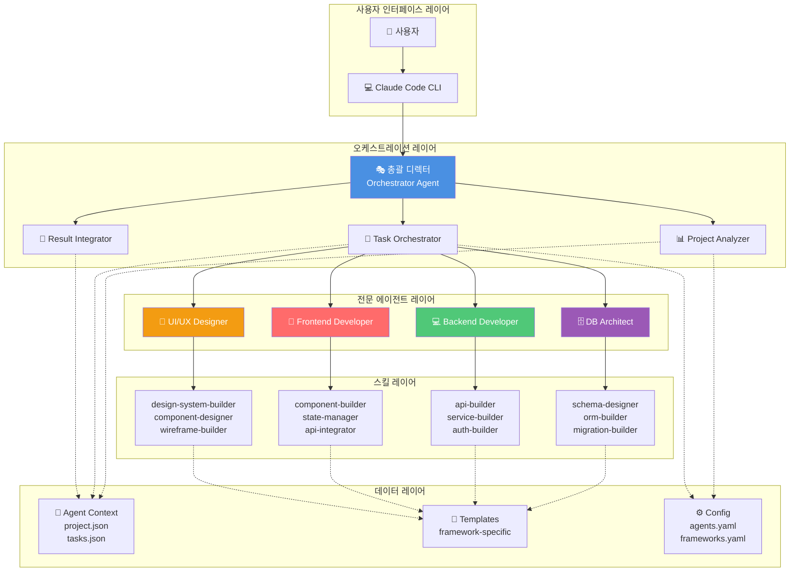

---

## 2. 에이전트 역할 및 책임

### 2.1 에이전트 책임 매트릭스

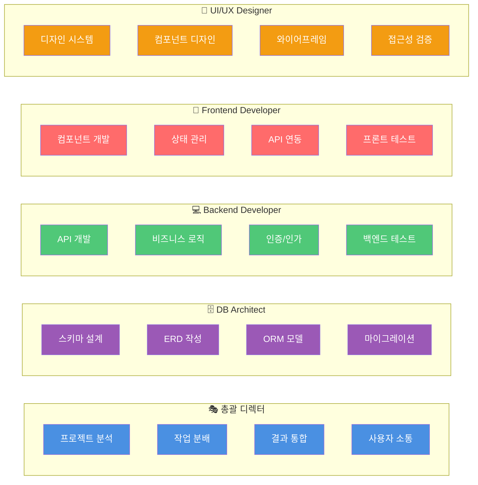

---

## 3. 작업 흐름 (워크플로우)

### 3.1 전체 워크플로우

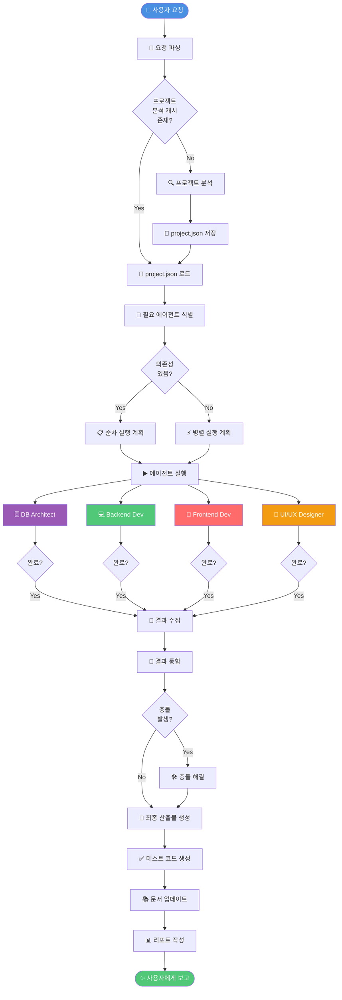

---

## 4. 데이터 흐름

### 4.1 컨텍스트 데이터 흐름

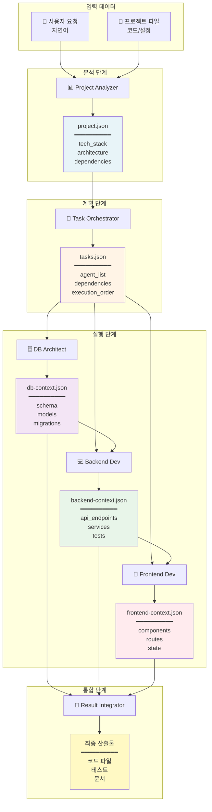

---

## 5. 의존성 그래프

### 5.1 에이전트 간 의존성

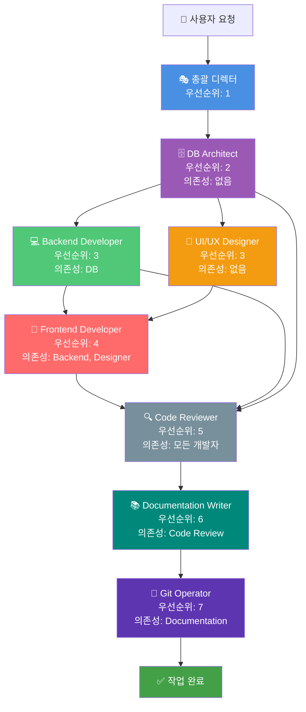

### 5.2 병렬 vs 순차 실행

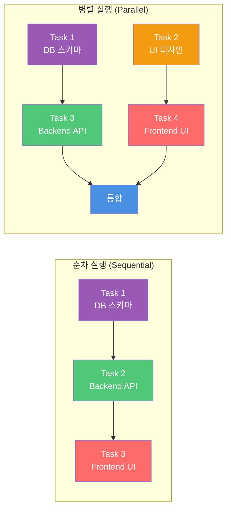

---

## 6. 시퀀스 다이어그램 (상세 예시)

### 6.1 전체 시스템 시퀀스

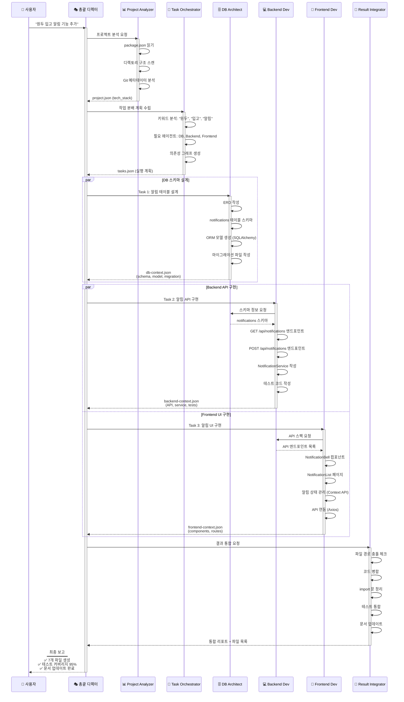

### 6.2 에러 처리 시퀀스

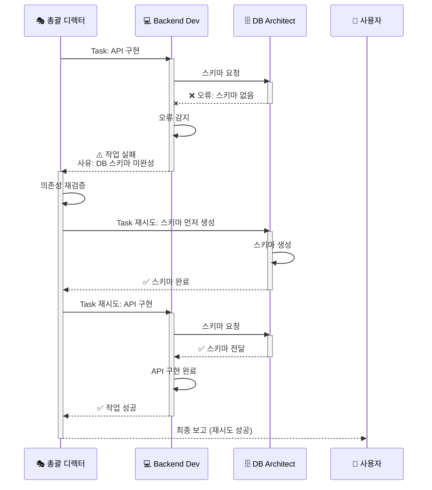

---

## 7. 파일 시스템 구조

### 7.1 디렉토리 트리

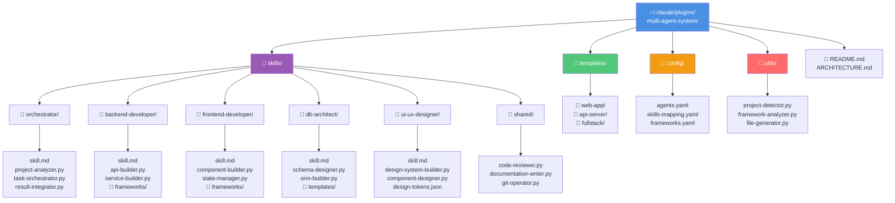

### 7.2 프로젝트별 컨텍스트

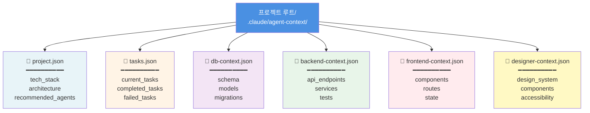

---

## 8. 상태 머신

### 8.1 작업 상태 전이

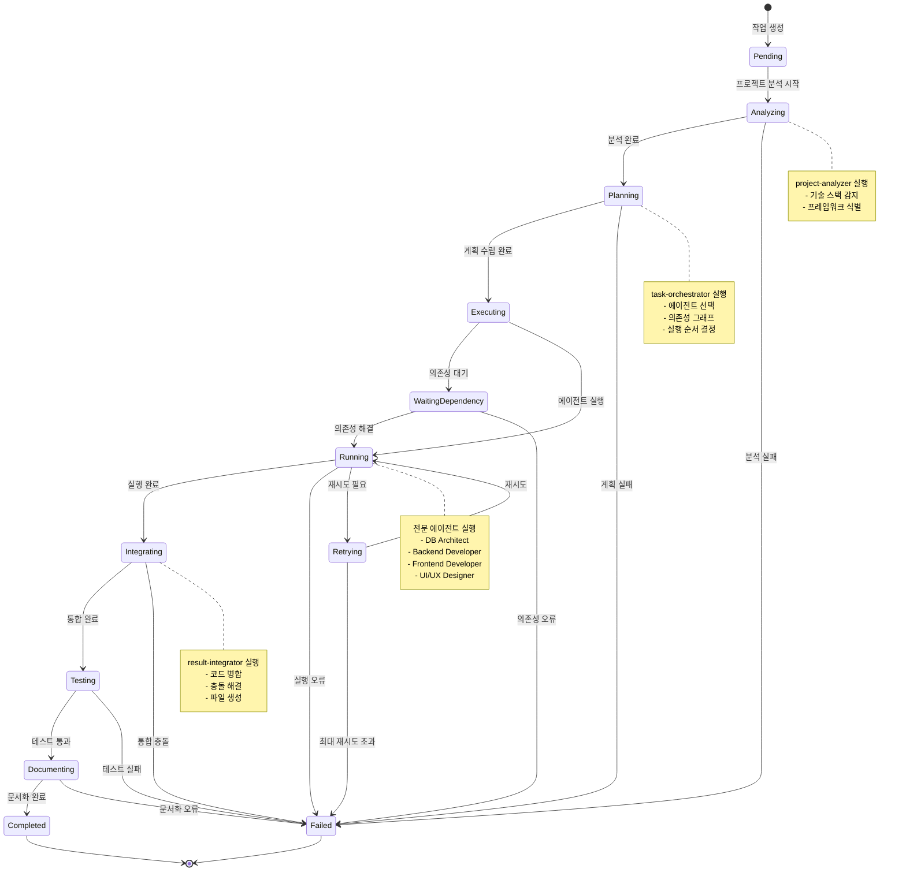

### 8.2 에이전트 상태 전이

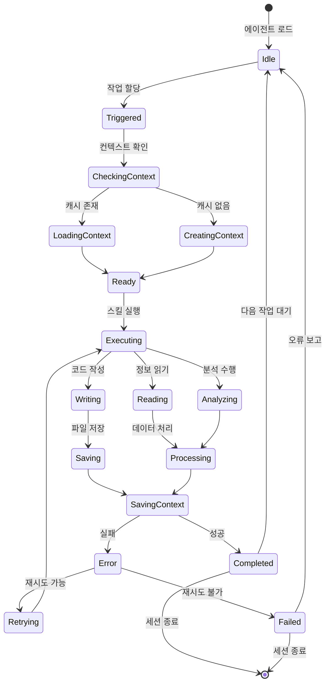

---

## 9. 통신 프로토콜

### 9.1 메시지 흐름

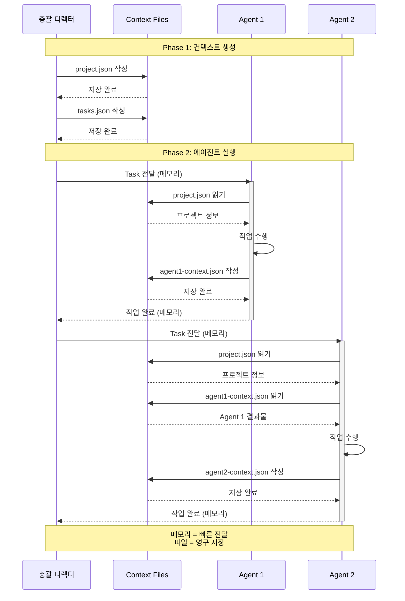

---

## 10. 프레임워크 감지 로직

### 10.1 결정 트리

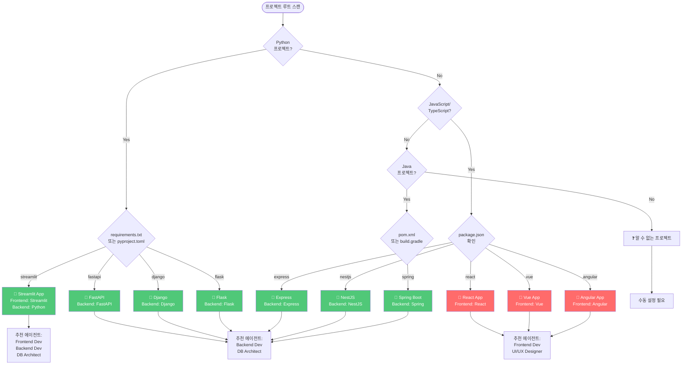

---

## 11. 성능 최적화 전략

### 11.1 캐싱 전략

### 11.2 병렬 실행 최적화

```mermaid
gantt
    title 작업 실행 타임라인 (순차 vs 병렬)
    dateFormat  ss
    axisFormat %S초

    section 순차 실행
    프로젝트 분석        :a1, 00, 10s
    DB 스키마 설계       :a2, after a1, 15s
    Backend API 구현     :a3, after a2, 20s
    Frontend UI 구현     :a4, after a3, 18s
    결과 통합           :a5, after a4, 7s
    총 70초             :milestone, after a5, 0s

    section 병렬 실행
    프로젝트 분석        :b1, 00, 10s
    DB 스키마 설계       :b2, after b1, 15s
    Backend API 구현     :b3, after b2, 20s
    Frontend UI 구현     :crit, after b2, 18s
    UI 디자인           :crit, after b1, 12s
    결과 통합           :b5, after b3, 7s
    총 52초             :milestone, after b5, 0s
```

---

## 📊 요약

### 주요 다이어그램 활용 가이드

| 다이어그램 | 용도 | 대상 |
|----------|------|------|
| **레이어드 아키텍처** | 전체 시스템 구조 이해 | 시스템 설계자 |
| **워크플로우** | 작업 흐름 파악 | 개발자 |
| **시퀀스 다이어그램** | 상세 동작 이해 | 구현 담당자 |
| **의존성 그래프** | 실행 순서 결정 | 총괄 디렉터 |
| **상태 머신** | 작업 상태 추적 | 디버깅 담당자 |
| **프레임워크 감지** | 자동 인식 로직 | 프로젝트 분석기 |

---

**작성자**: Claude Code
**버전**: v1.0.0
**최종 업데이트**: 2025-11-08
